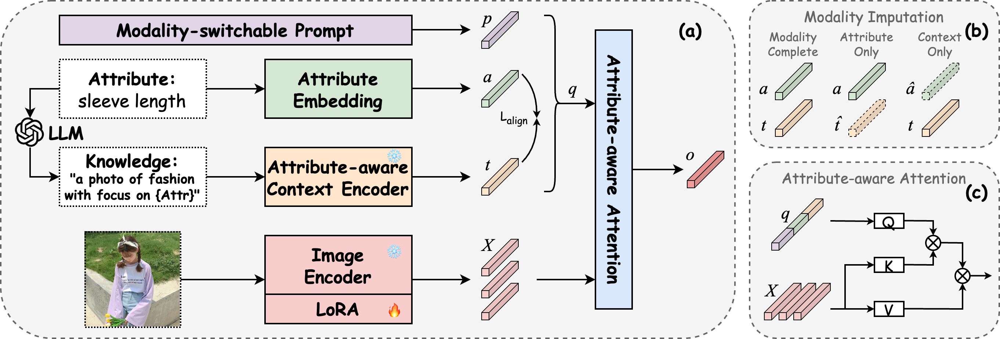

# Open-World Fine-Grained Fashion Retrieval with LLM-based Commonsense Knowledge Infusion
This repository contains the implementation of our SIGIR'25 full paper.


## Table of Contents

* [Environments](#environments)
* [Datasets](#datasets)
* [Configuration](#configuration)
* [Training](#training)
* [Evaluation](#evaluation)

## Environments
- **Ubuntu** 22.04
- **CUDA** 12.2
- **Python** 3.9

Install other required packages by
```sh
pip install -r requirements.txt
```

## Datasets
We conduct experiments on three fashion related datasets, i.e., FashionAI, DARN, and DeepFashion. Please download and put them in the corresponding folders.

### Download Data

#### FashionAI

As the full FashionAI has not been publicly released, we utilize its early version for the [FashionAI Global Challenge 2018](https://tianchi.aliyun.com/competition/entrance/231671/introduction?spm=5176.12281949.1003.9.493e3eafCXLQGm). You can first sign up and download two training subsets:

- **fashionAI_attributes_train1.zip(6G)**
- **fashionAI_attributes_train2.zip(7G)**. 

Once done, you should uncompress and link them into the `data/FashionAI` directory.

#### DARN

As some images’ URLs have been broken, only 214,619 images are obtained for our experiments. We provide a series of [URLs](https://drive.google.com/file/d/10jpHsFI2njzEGl7kdACXbvstz6tXyE0R/view?usp=sharing) for the images. Please download them into a `pic` directory that should be created in `data/DARN` directory.

#### DeepFashion

[DeepFashion](https://www.cv-foundation.org/openaccess/content_cvpr_2016/papers/Liu_DeepFashion_Powering_Robust_CVPR_2016_paper.pdf) is a large dataset which consists of four benchmarks for various tasks in the field of clothing including [category and attribute prediction](http://mmlab.ie.cuhk.edu.hk/projects/DeepFashion.html) which we use for our experiments, in-shop clothes retrieval, fashion landmark  detection and consumer-to-shop clothes retrieval. Download the images into a `img` directory that should be created in `data/DeepFashion` directory.

### Configuration

The behavior of our codes is controlled by configuration files under the `config` directory. 

```sh
config
│── FashionAI
│   ├── FashionAI.yaml
│   ├── train.yaml
├── DARN
│   ├── DARN.yaml
│   ├── train.yaml
└── DeepFashion
    ├── DeepFashion.yaml
    ├── train.yaml
```

Each dataset is configured by two types of configuration files. One is `<Dataset>.yaml` that specifies basic dataset information such as path to the training data and annotation files. The other sets some training options as needed.

If the above `data` directory is placed at the same level with `main.py`, no changes are needed to the configuration files. Otherwise, be sure to correctly configure relevant path to the data according to your working environment.

## Training

Run the following script that uses default settings:

```python
python main.py --cfg config/<Dataset>/<Dataset>.yaml config/<Dataset>/train.yaml
```

## Evaluation

Run the following script to test on the trained models:

```python
python main.py --cfg config/<Dataset>/<Dataset>.yaml config/<Dataset>/train.yaml --resume runs/<Dataset>_train/model_best.pth.tar --test TEST
```

We release several pretrained models:
- Coki on FashionAI: [released_model](https://drive.google.com/file/d/15B1MjoPYb9j0fNEmedtCCGS3BiaJC-Lv/view?usp=sharing)
- Coki on DARN: [released_model](https://drive.google.com/file/d/19OA687V5DC_S6dcVDiTgTKhiHzwDdLlr/view?usp=sharing)
- Coki on DeepFashion: [released_model](https://drive.google.com/file/d/1XMXJ_q9s0Oh5xGgvre57gKrPoZ40PKGK/view?usp=sharing)
